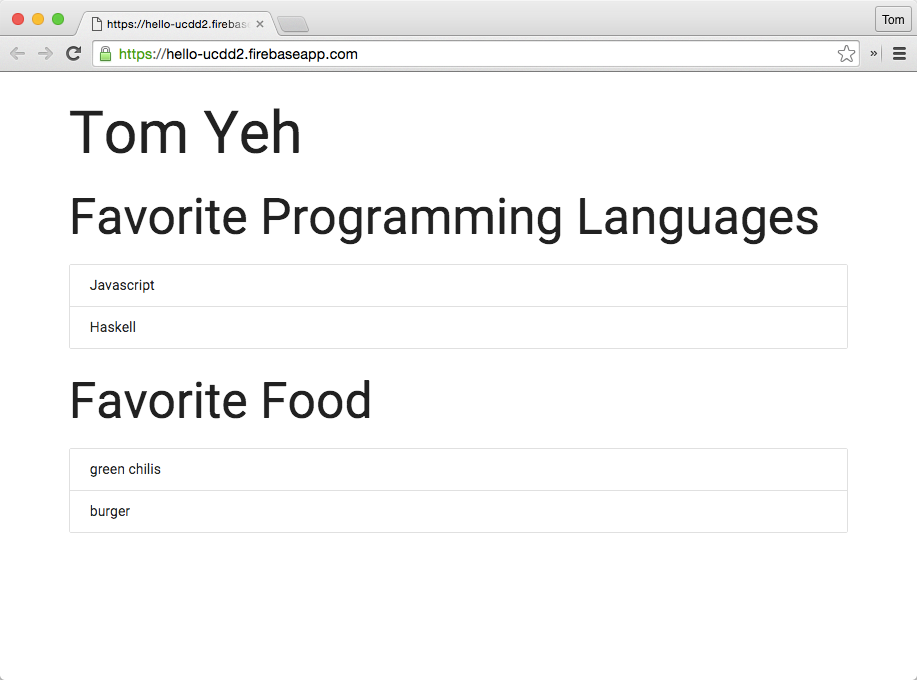
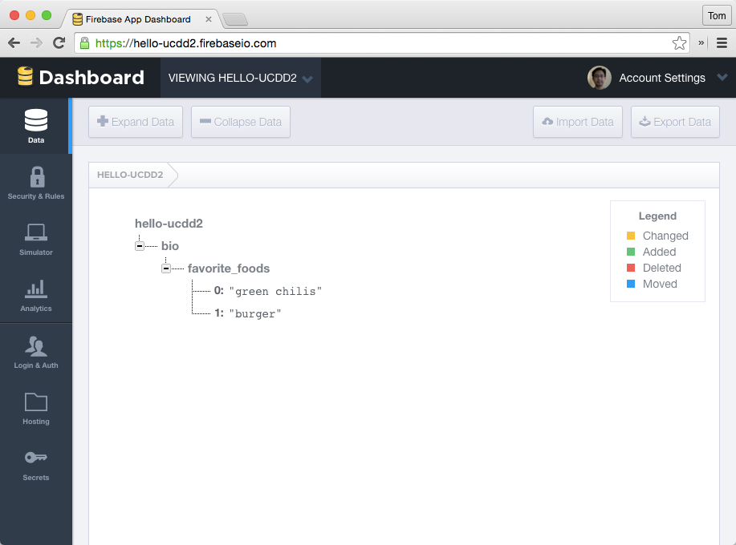

# hello-ucdd2

# Warmup Learning Challenge

This is a simple single-page homepage that shows a person's name, favorite
programming languages, and favorite foods. The favorite foods are loaded from
the Firebase dynamically.

Your objective is to host your own version of this single-page homepage.

If you are successful, you should have a site that looks like this:



[https://hello-ucdd2.firebaseapp.com/](https://hello-ucdd2.firebaseapp.com/)

## Due
before the first class

Jan 11, Monday 4pm

## Milestones

Add an x for each milestone completed

### Making a Copy

* [x] Read this document
* [ ] Fork this repository
* [ ] Signup for a Firebase account
* [ ] Create a new Firebase of your own
* [ ] Host a copy of this site using your own Firebase

### Personalizing

In `public/index.html`

* [ ] Change the name to show your own name
* [ ] Change the Firebase link to your own firebase
* [ ] Add data about your favorite foods to your own firebase at the location `bio/favorite_foods`

## Hints

### Getting data into Firebase

The data used in the example has the following structure in the JSON format:
```javascript
{
  "bio" : {
    "favorite_foods" : [ "green chilis", "burger" ]
  }
}
```

In your Firebase data browser, you want to be able to see something like this:



There are at least three methods to get your data in
1. Use the IMPORT button
2. Use the GUI to manually enter the data
3. Use the [Firebase command line tools](https://github.com/firebase/firebase-tools) and the `data:set` command.

## Resources

* [Firebase](https://www.firebase.com/)
	* [Quick Start](https://www.firebase.com/docs/web/quickstart.html)
	* [Static Hosting](https://www.firebase.com/docs/hosting/)
	* [Firebase.once()](https://www.firebase.com/docs/web/api/query/once.html)
